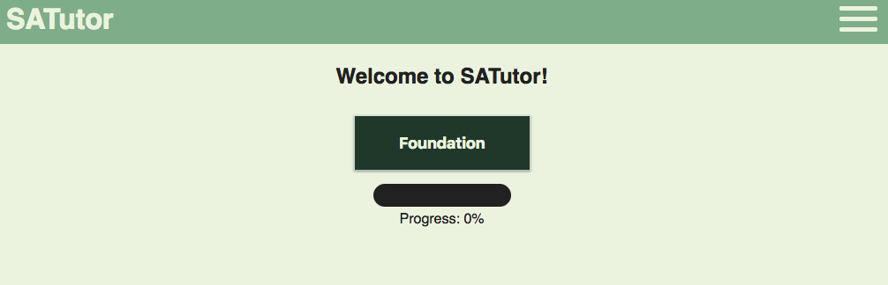
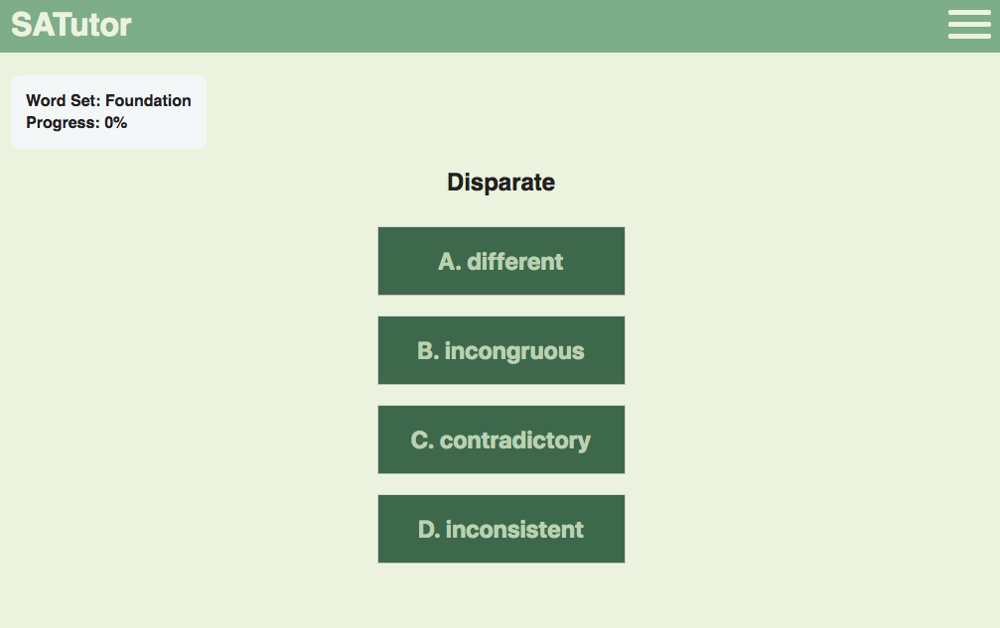
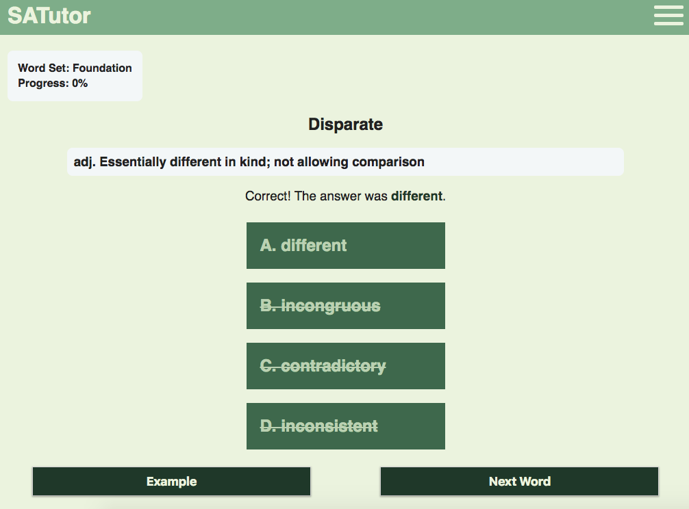
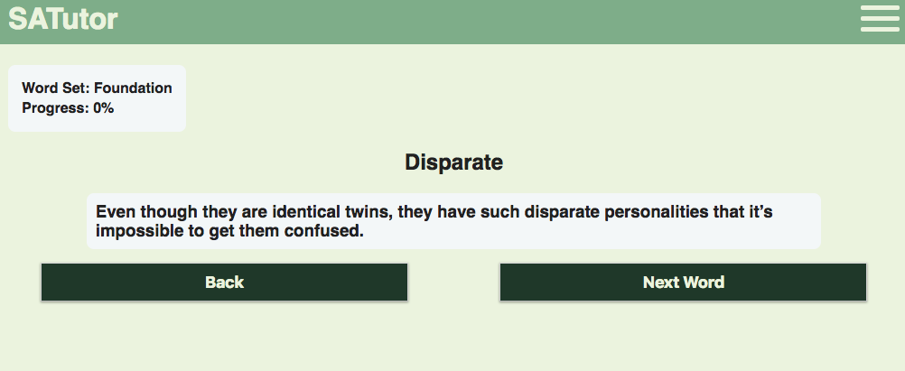

# SATutor

## About the App:
SATutor is a free app to help students improve their vocabulary in preparation for the Verbal portion of the SAT I. It is built on a spaced-repeitition algorithm to optimize a student's capacity to memorize new words without forgetting the words they have previously learned. The general concept behind the algorithm is that students need to revisit words that they learn periodically, so that they solidify their understanding. It was developed to counteract the general forgetting curve. SATutor will do all the work in terms of determining when a student should revisit a word they previously learned in order to not forget it.

##### Live Deploy: https://satutor.netlify.com/

## Screenshots:

Landing Page:
----------------------------------------------------------------------------------------------

Question:
----------------------------------------------------------------------------------------------

Feedback:
----------------------------------------------------------------------------------------------

Example Sentence:
----------------------------------------------------------------------------------------------

## Component Breakdown:

Standard Login Form and Registration Page. Before Login user can also access About and FAQs pages that describe the foundational principles behind the purpose the app, the technology that makes it work, and how a user can engage with the app.

After login the user has a few components that they cycle through:

##### Landing Page:

User selects the word set they want to work on. Newly created word sets can be added at any time to the landing page, so users will have access to more words to practice as the app grows and more word sets are developed.

##### Question:

Once the user selects a given word set they are presented with the first word which is a multiple choice question trying to match the word that is most similar to the definition of the word.

##### Feedback:

After making their selection the user is presented with feedback about how they did on the question. Feedback also includes the definition of the given word.

##### Example:

If the user is still confused about the meaning of a word, or simply wants to reinforce their understanding, they can view an example of the given word used in a sentence.

##### Word Set Overview

Throughout a users time working on a word set they will see their mastery progress of that given word set. That progress percentage will dynamically change throughout a users time working on a given word set when they've hit a certain threshold where the user can be confident they know a given word.

## Algorithm:
##### Name: 
Spaced-Repetition
##### Data Structure: 
Singly-Linked List
##### Purpose: 
Designed to optimize learning based on the Forgetting Curve.

## Technology Stack:
##### Front End: 
React/Redux, HTML, CSS, JS
##### Back End: 
Node.js, Express.js
##### Authentication: 
Passport.js, JWT
##### Database: 
MongoDB, Mongoose
##### Hosting Platforms: 
Netlify, Heroku, mLab

## Engineering Team:
##### Front End: 
Sam Gould
##### Back End: 
Vernon Mensah
